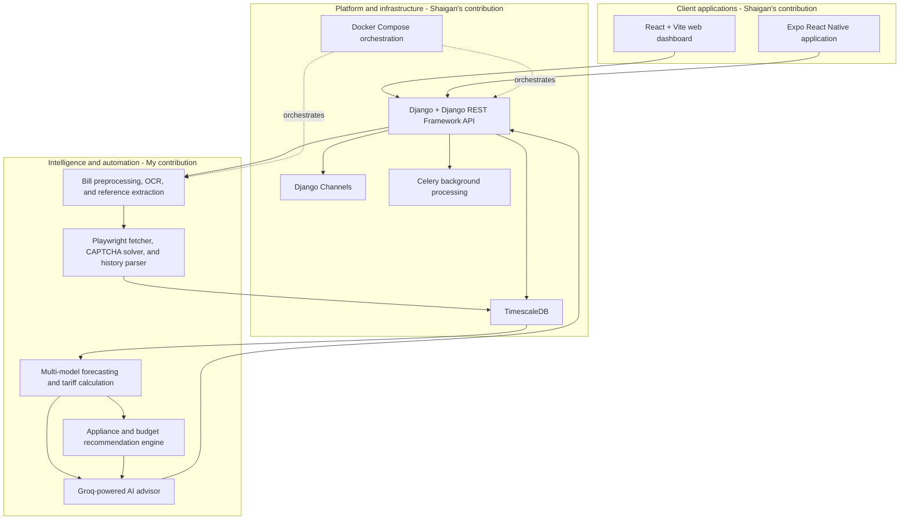

# Smart Electricity Bill Prediction and Advisory System

An end-to-end electricity analytics platform developed for LESCO consumers and delivered through a web dashboard and mobile application. The system automates electricity-bill data collection, forecasts future energy consumption, calculates tariff-aware bill estimates, extracts customer reference numbers from bill images, recommends appliance-level energy reductions, and provides personalized guidance through an AI chatbot.

This collaborative Final Year Project combines **Django REST APIs**, **real-time communication**, **background task processing**, **time-series data storage**, **React**, **React Native**, **time-series forecasting**, **computer vision**, **optical character recognition (OCR)**, **browser automation**, **web scraping**, **rule-based recommendation**, **tariff modeling**, and **large language model (LLM) integration** in a containerized, modular workflow.

## Table of Contents

- [Project Overview](#project-overview)
- [Problem Statement](#problem-statement)
- [My Contributions](#my-contributions)
- [Team Contributions and Learning](#team-contributions-and-learning)
- [Full Project Structure](#full-project-structure)
- [System Architecture](#system-architecture)
- [Platform Components](#platform-components)
- [Core Modules](#core-modules)
  - [1. Electricity Consumption Prediction](#1-electricity-consumption-prediction)
  - [2. Tariff and Bill Calculation](#2-tariff-and-bill-calculation)
  - [3. OCR and Reference Number Extraction](#3-ocr-and-reference-number-extraction)
  - [4. Automated LESCO History Fetching](#4-automated-lesco-history-fetching)
  - [5. Appliance-Level Recommendation System](#5-appliance-level-recommendation-system)
  - [6. AI Chatbot Advisor](#6-ai-chatbot-advisor)
- [End-to-End Workflow](#end-to-end-workflow)
- [Algorithms and Technical Decisions](#algorithms-and-technical-decisions)
- [Technology Stack](#technology-stack)
- [Validation, Reliability, and Error Handling](#validation-reliability-and-error-handling)
- [Key Engineering Outcomes](#key-engineering-outcomes)
- [ATS-Focused Technical Skills](#ats-focused-technical-skills)
- [Limitations and Future Improvements](#limitations-and-future-improvements)

## Project Overview

The project helps electricity consumers answer three practical questions:

1. **What is my expected electricity consumption and bill?**
2. **Why is my bill high?**
3. **What actions can I take to reduce it and stay within budget?**

Instead of depending on manual data entry or generic energy-saving advice, the system uses each consumer's electricity history, live meter readings, appliance usage, tariff status, and budget to generate personalized forecasts and recommendations.

The solution was designed with a modular architecture so that client applications, APIs, background tasks, data storage, forecasting, billing, OCR, data acquisition, recommendations, and conversational AI can be developed, tested, deployed, and maintained independently.

## Problem Statement

Electricity consumers often struggle to:

- estimate their bill before the billing cycle ends;
- understand how tariff slabs, taxes, FPA, QTA, and fixed charges affect the final amount;
- identify the appliances responsible for high energy consumption;
- manually collect and organize historical billing data;
- extract reference information from unclear bill photographs or screenshots; and
- convert technical billing information into practical, personalized actions.

This system addresses those challenges by turning raw bill images, LESCO history records, meter readings, and appliance information into an explainable prediction and advisory workflow.

## My Contributions

I designed and implemented the project's core intelligence and automation modules, including:

- Developed a **multi-model time-series forecasting pipeline** for next-month electricity consumption.
- Implemented **Leave-One-Out Cross-Validation (LOOCV)** and **Mean Absolute Error (MAE)** comparison to select the best forecasting model for an individual consumer.
- Built a **confidence-weighted ensemble** that combines historical forecasts with live, current-cycle meter projections.
- Created a modular **LESCO tariff and bill calculation engine** covering consumer categories, tariff slabs, fixed charges, taxes, regulatory adjustments, and government levies.
- Developed an image preprocessing and **OCR pipeline** using Tesseract, EasyOCR, and OpenCV.
- Implemented robust **LESCO reference number extraction** using contextual search, regular expressions, OCR-noise correction, normalization, multi-variant voting, and fallback recognition.
- Automated retrieval of 12-month consumption history from the LESCO portal using **Playwright browser automation**, CAPTCHA recognition, retries, and HTML parsing.
- Built a structured history parser with **BeautifulSoup**, chronological sorting, numeric cleaning, duplicate removal, and predictor-ready data transformation.
- Created an appliance database and a **rule-based recommendation engine** that calculates device-level consumption and tariff-aware savings.
- Implemented budget analysis using **binary search** and automatic reduction recommendations using a **greedy algorithm**.
- Integrated the **Groq API** and **Llama 3.3 70B** to provide personalized, context-aware electricity guidance through natural-language conversations.
- Added reliability features such as lazy model loading, graceful exception handling, validation rules, confidence scoring, early-exit optimization, retry logic, and diagnostic outputs.

## Team Contributions and Learning

This was a collaborative project completed with my friend and teammate, **Shaigan**. The contribution split is documented to represent our work accurately.

| Contributor | Primary ownership | Contribution details |
|---|---|---|
| **My contribution** | Intelligence and automation modules | Bill prediction, tariff-aware estimation, OCR and reference extraction, LESCO history fetching, CAPTCHA solving, history parsing, appliance recommendation, budget optimization, and the Groq-powered AI advisor |
| **Shaigan's contribution** | Full-stack platform and infrastructure | Django backend and APIs, Django REST Framework, Channels, Celery processing, TimescaleDB integration, React and Vite web dashboard, Expo React Native mobile application, Docker Compose orchestration, and integration of the platform services |

Although Shaigan led the full-stack and infrastructure implementation, he explained the architecture and development process to me throughout the project. Through this collaboration, I learned how my Python intelligence modules connected with:

- Django and Django REST Framework API endpoints;
- Channels-based real-time communication;
- Celery background and asynchronous tasks;
- TimescaleDB-backed time-series data storage;
- React and Vite web interfaces;
- Expo React Native mobile workflows;
- service-to-service integration; and
- Docker Compose-based multi-service deployment.

This knowledge transfer gave me practical exposure to the complete application lifecycle and helped me understand the full end-to-end system beyond the modules I directly implemented. These platform technologies are therefore presented as **collaborative learning and integration exposure**, not as solely authored work.

## Full Project Structure

```text
.
├── backend/                Django API (DRF, Channels, Celery, TimescaleDB)
├── frontend/               React + Vite web dashboard
├── mobile/                 Expo React Native application
├── module_1_predictor/     Bill prediction model
├── module_2_ocr/           EasyOCR + Tesseract bill scanner
├── module_3_fetcher/       LESCO history scraper
├── module_4_recommender/   Rule-based energy recommendations
├── module_5_chatbot/       Groq-powered AI advisor
└── docker-compose.yml      Single-command stack for all seven services
```

The five domain modules contain my primary implementation work. Shaigan developed the surrounding backend, frontend, mobile, and containerized platform that exposed these capabilities as a complete user-facing application.

## System Architecture



## Platform Components

The following platform components were primarily implemented by Shaigan and integrated with my domain modules:

### Backend API

The `backend/` service used **Django** and **Django REST Framework (DRF)** to expose application capabilities through APIs. **Django Channels** supported real-time communication, **Celery** handled background processing, and **TimescaleDB** supported storage of time-oriented electricity records. This layer coordinated requests between the web/mobile clients and the prediction, OCR, fetcher, recommender, and chatbot modules.

### Web dashboard

The `frontend/` application used **React** with **Vite** to provide a browser-based dashboard for submitting consumer information, uploading bill images, viewing forecasts and bill breakdowns, exploring appliance consumption, receiving recommendations, and interacting with the AI advisor.

### Mobile application

The `mobile/` application used **Expo React Native** to make the platform's main workflows accessible from mobile devices through the same integrated backend services.

### Containerized services

The root `docker-compose.yml` provided a single-command, multi-service environment for the documented seven-service stack. Container orchestration made the system easier to start consistently and supported integration between the platform layer and the intelligence modules.

## Core Modules

### 1. Electricity Consumption Prediction

I developed a forecasting pipeline that evaluates multiple algorithms because electricity usage patterns differ between households. Some users have strong seasonal behavior, while others show stable usage, long-term trends, or recent behavioral changes.

#### Forecasting models

- **Holt-Winters Exponential Smoothing** - models trend and seasonality together, making it suitable for recurring summer and winter demand patterns.
- **Seasonal Exponentially Weighted Moving Average (Seasonal EWMA)** - preserves seasonal behavior while giving more importance to recent observations.
- **Weighted Moving Average (WMA)** - forecasts from the latest six months, assigning progressively higher weights to more recent consumption.
- **Exponentially Weighted Moving Average (EWMA)** - smooths noisy usage while remaining responsive to recent changes.
- **Seasonal Naive Forecasting** - uses the corresponding month from the previous year as a transparent seasonal baseline.
- **Linear Trend Forecasting** - applies regression-based trend analysis to identify long-term increases or decreases.
- **Daily Projection** - estimates total current-cycle usage from meter readings:

```text
Projected Units = (Units Consumed So Far / Days Elapsed) x Total Billing-Cycle Days
```

#### Model evaluation and selection

Each historical model is evaluated with **Leave-One-Out Cross-Validation**. The pipeline repeatedly trains on earlier observations, predicts an unseen month, compares the prediction with the actual value, and calculates **Mean Absolute Error**.

```text
Best Historical Model = Model with the Lowest MAE
```

This approach provides consumer-specific model selection instead of assuming that a single forecasting algorithm performs best for every household.

#### Confidence-weighted forecast blending

I implemented dynamic confidence weighting between:

- the best historical model; and
- the current billing-cycle daily projection.

Early in the billing cycle, limited live data is available, so historical behavior receives more weight. As the cycle progresses, the system gradually trusts the meter-based projection more. A sigmoid function provides a smooth transition:

```text
Projection Confidence = 1 / (1 + exp(-10 x (Cycle Progress - 0.5)))
```

Historical reliability is also assessed using the **coefficient of variation**. Stable histories receive higher confidence, while irregular histories receive lower confidence.

The final forecast is calculated as:

```text
Final Units =
    (History Weight x Historical Forecast)
  + (Projection Weight x Daily Projection)
```

The pipeline returns model predictions, MAE scores, the selected historical model, live projection, confidence weights, blended forecast, final displayed forecast, and estimated bill.

### 2. Tariff and Bill Calculation

I separated billing logic from forecasting logic to improve **modularity**, **maintainability**, **testability**, and tariff-update management.

The billing engine converts predicted units into a detailed LESCO bill estimate using:

- protected and unprotected consumer tariff tables;
- non-telescoping slab selection;
- sanctioned-load-based fixed charges;
- Electricity Duty;
- GST;
- PTV fee;
- filer and non-filer income tax rules;
- Fuel Price Adjustment (FPA);
- Quarterly Tariff Adjustment (QTA);
- minimum charges; and
- applicable late-payment surcharge data.

#### Non-telescoping tariff handling

The documented tariff model is non-telescoping: once consumption enters a slab, the applicable slab rate is used for all consumed units. This makes bill savings non-linear, especially around slab boundaries.

```text
Energy Cost = Units Consumed x Applicable Slab Rate
Fixed Charge = Fixed Rate per kW x Sanctioned Load
FPA Amount = Units Consumed x FPA per Unit
QTA Amount = Units Consumed x QTA per Unit
Total Bill = LESCO Charges + Government Charges + Applicable Surcharge
```

Consumer protection status can be inferred from recent usage. If any of the last three months exceeds the protected-consumer threshold, the unprotected tariff rules are applied.

The output includes a transparent bill breakdown rather than only a total, supporting explainability in both the user interface and chatbot.

### 3. OCR and Reference Number Extraction

I built a multi-stage computer vision pipeline to extract information from electricity bill photographs, screenshots, and image-based documents.

#### Image preprocessing

The preprocessing pipeline supports file paths, PIL images, and raw image bytes, then generates multiple OCR-ready image variants.

Processing includes:

- grayscale conversion;
- image-size capping for large phone photographs;
- conditional upscaling for low-resolution text;
- Contrast Limited Adaptive Histogram Equalization (**CLAHE**);
- denoising;
- Otsu binarization;
- adaptive thresholding;
- Canny edge detection;
- contour detection;
- perspective correction using a four-point transform;
- rotation estimation and deskewing;
- header cropping for reference-number labels;
- middle-region cropping for shifted screenshot layouts; and
- bottom-region cropping for barcode-area reference information.

Multiple variants are necessary because no single preprocessing method is reliable across every lighting condition, camera angle, bill layout, or image quality level.

#### Dual OCR strategy

The system uses:

- **Tesseract OCR** as the fast primary engine with Page Segmentation Modes 6, 11, and 3; and
- **EasyOCR** as a higher-cost fallback for difficult or low-quality images.

Results produced by multiple OCR modes are merged and deduplicated. Lazy loading prevents repeated OCR-model initialization and reduces processing overhead.

#### Reference number extraction

LESCO reference numbers are extracted through a layered strategy:

1. Search around context labels such as `REF NO`, `REFERENCE NO`, and `REFERENCE NUMBER`.
2. Correct common OCR substitutions such as `O -> 0` and `I/l -> 1`.
3. Clean OCR noise and normalize spacing and separators.
4. Apply multiple regular-expression patterns for spaced, unspaced, hyphenated, loose, and combined formats.
5. Search adjacent lines when the label and reference value appear separately.
6. Scan the complete OCR text when contextual extraction fails.
7. Vote across candidates obtained from multiple image variants.
8. Stop early when enough variants agree.
9. Run EasyOCR as a fallback when Tesseract produces no valid candidate.

The normalized format is:

```text
2 digits + 5 digits + 7 digits + optional trailing letter
Example: 08 11274 1172000U
```

The module returns the selected reference number, success status, confidence score, extraction method, all candidate hits, raw OCR text, and the number of variants processed. When extraction fails, it returns user guidance rather than terminating the entire workflow.

### 4. Automated LESCO History Fetching

I automated the collection of a consumer's electricity history using **Playwright** because the LESCO portal requires interactive form entry, multi-page navigation, CAPTCHA validation, and browser-rendered content.

#### Browser automation workflow

1. Validate, clean, and split the consumer reference number into the fields required by the portal.
2. Launch a Chromium browser and create a normal browser context.
3. Open the LESCO bill-checking portal.
4. Dismiss obstructive pop-ups.
5. Fill reference-number components into the form.
6. Navigate to the CAPTCHA step.
7. Capture the CAPTCHA element as image bytes.
8. Convert the screenshot into an OpenCV image.
9. Upscale the small CAPTCHA image four times.
10. Generate grayscale, CLAHE, Otsu, inverted Otsu, adaptive, inverted adaptive, color-CLAHE, and sharpened variants.
11. Run EasyOCR with an alphanumeric allowlist.
12. Clean the OCR output and prioritize four-character candidates.
13. Use majority voting and a confidence score to select the most reliable code.
14. Submit the CAPTCHA and detect rejection messages.
15. Retry failed CAPTCHA attempts up to the configured maximum.
16. Verify arrival at the consumption and payment history page.
17. Extract the page HTML for structured parsing.
18. Save optional screenshots for diagnostics when the portal layout changes.
19. Close the browser and release resources.

Proxy support is included for environments where the LESCO portal may restrict traffic from foreign cloud hosts. A custom `FetchError` separates domain-specific retrieval errors, such as invalid references, CAPTCHA failure, and website timeouts, from generic application failures.

#### History parsing and transformation

After the page is fetched, **BeautifulSoup** is used to:

- scan tables and detect the history table through month-like values;
- extract month, consumed units, bill amount, and payment information;
- remove commas and other numeric formatting before integer conversion;
- convert two-digit years into four-digit years;
- map month names to numeric indices;
- sort records chronologically;
- remove duplicate months;
- retain the most recent 12 months; and
- produce predictor-ready `history_units` and `history_bills` arrays.

Latest-month metadata is also returned for reporting and quick access. Preserving temporal order is essential because the forecasting pipeline depends on correctly sequenced time-series data.

### 5. Appliance-Level Recommendation System

I developed a transparent, rule-based recommendation engine to explain where electricity is being used and identify the most practical reductions.

#### Appliance database

The system includes a lightweight Python dictionary of common Pakistani household appliances with:

- appliance name;
- power rating in watts;
- category; and
- descriptive or efficiency notes.

Categories include cooling, heating, kitchen, laundry, entertainment, office, lighting, and utility appliances. The module supports exact lookup, case-insensitive search, keyword search, category search, category grouping, and user-defined appliances.

An in-memory dictionary was chosen because the documented dataset contains only around 40-50 appliances and benefits from fast, low-overhead lookup.

#### Consumption analysis

Monthly appliance consumption is calculated as:

```text
Monthly Units =
    (Wattage x Hours per Day x Quantity x 30 Days) / 1000
```

For every appliance, the system calculates:

- monthly electricity units;
- percentage of total appliance consumption;
- potential units saved per hour of daily reduction; and
- actual bill impact of a reduction.

Appliances are ranked from highest to lowest energy usage so the user can focus on the most impactful changes first.

#### Tariff-aware savings

Savings are not estimated with a simple `units saved x rate` formula. The system calls the full bill calculator before and after every proposed change:

```text
Money Saved = Current Calculated Bill - Recalculated Reduced-Usage Bill
```

This method detects tariff-slab transitions and captures the larger saving that may occur when reduced consumption moves the consumer into a lower slab.

#### Budget optimization

The recommendation engine calculates both the PKR budget gap and the unit-reduction gap.

- **Binary search** determines the minimum consumption reduction required to reach a target bill efficiently.
- A **greedy algorithm** prioritizes high-consumption appliances and evaluates daily reduction levels such as 0.5, 1, 2, 3, 4, 6, or all usage hours.
- User-selected reductions are applied sequentially with running unit and bill totals.
- The final output reports suggested actions, units saved, adjusted units, recalculated bill, money saved, slab transitions, and whether PKR or unit budgets were achieved.

The rule-based design was selected because electrical consumption formulas and tariff rules are deterministic. It is explainable, auditable, and suitable for actionable household recommendations without requiring a training dataset.

### 6. AI Chatbot Advisor

I integrated a conversational advisory layer using the **Groq API** with the `llama-3.3-70b-versatile` model. The chatbot acts as an intelligent interface across the forecasting, billing, history, appliance, and budget modules.

Users can ask questions such as:

- Why is my predicted bill high?
- Which appliance consumes the most electricity?
- Am I close to a tariff slab boundary?
- How can I reach my monthly budget?
- What does each component of my bill mean?
- Can you create a week-by-week reduction plan?

#### Context engineering and personalization

A context builder gathers:

- consumer reference and account settings;
- protected or unprotected status;
- sanctioned load;
- tariff, FPA, QTA, duty, and tax-filer settings;
- 12-month consumption and bill history;
- average, minimum, maximum, and trend information;
- predicted units and estimated bill;
- detailed energy, tax, and adjustment breakdowns;
- appliance-level consumption sorted by usage; and
- PKR and unit budget targets.

The context is converted into a structured system prompt that defines the model as a LESCO electricity advisor. Tariff knowledge and actual user data are injected into every conversation, allowing the model to produce grounded, personalized answers rather than generic suggestions.

#### LLM behavior and user experience

- A low temperature of `0.35` prioritizes factual consistency and predictable advice.
- Role-based `system`, `user`, and `assistant` messages maintain conversation history.
- Streaming displays generated text incrementally for a responsive user experience.
- Starter prompts guide users toward meaningful electricity-related questions.
- Guardrails restrict responses to the electricity advisory domain.

Prompt engineering was selected instead of fine-tuning because it is faster to iterate, easier to maintain, and can personalize responses directly from live user data without training a separate model.

## End-to-End Workflow

```text
User uploads a bill image or enters a reference number
    -> Image preprocessing generates OCR-optimized variants
    -> OCR and pattern matching extract the LESCO reference number
    -> Playwright opens the LESCO portal and submits customer details
    -> CAPTCHA solver preprocesses, recognizes, votes, and retries
    -> Auto-fetcher opens the consumption and payment history page
    -> BeautifulSoup parses and cleans the latest 12 months of data
    -> Forecasting models generate next-cycle predictions
    -> LOOCV and MAE select the best historical model
    -> Live meter projection is blended using dynamic confidence weights
    -> Tariff engine calculates a detailed estimated bill
    -> Appliance engine identifies high-consumption devices
    -> Budget optimizer proposes practical usage reductions
    -> AI chatbot explains predictions, costs, trends, and actions
```

## Algorithms and Technical Decisions

| Requirement | Technique | Engineering Rationale |
|---|---|---|
| Forecast seasonal consumption | Holt-Winters and Seasonal Naive | Captures recurring annual usage patterns |
| Adapt to recent behavior | EWMA, Seasonal EWMA, and WMA | Gives recent observations greater influence |
| Select a model per consumer | LOOCV with MAE | Provides objective, user-specific performance comparison |
| Combine history and live data | Sigmoid confidence weighting | Smoothly shifts trust as the billing cycle progresses |
| Assess history reliability | Coefficient of variation | Reduces confidence in irregular historical data |
| Read inconsistent bill images | Multi-variant OpenCV preprocessing | Improves robustness across lighting, angle, blur, and layout changes |
| Balance OCR speed and accuracy | Tesseract primary, EasyOCR fallback | Avoids high-cost OCR unless required |
| Extract structured references | Context search, regex, normalization, and voting | Reduces false matches and common OCR errors |
| Automate portal interaction | Playwright with Chromium | Supports form entry, navigation, CAPTCHA, and dynamic pages |
| Extract billing history | BeautifulSoup table parsing | Converts raw HTML into structured time-series records |
| Solve CAPTCHA reliably | Eight preprocessing variants and majority voting | Uses agreement across OCR results as confidence evidence |
| Find minimum budget reduction | Binary search | Efficiently searches a non-linear tariff space |
| Recommend practical actions | Greedy appliance prioritization | Produces fast, understandable high-impact suggestions |
| Calculate real savings | Full bill recalculation | Correctly handles non-linear slab transitions |
| Generate personalized explanations | LLM context injection and prompt engineering | Grounds natural-language guidance in actual user data |

## Technology Stack

### Full-stack application platform

- Django
- Django REST Framework (DRF)
- Django Channels
- Celery
- TimescaleDB
- React
- Vite
- Expo React Native
- REST API integration
- Real-time communication
- Background task processing

> The full-stack platform was primarily implemented by Shaigan. My experience with these technologies came from module integration, architectural walkthroughs, and collaborative learning during the project.

### Programming and data processing

- Python
- NumPy-based numerical analysis
- Time-series forecasting
- Regression and exponential smoothing
- In-memory Python data structures

### Computer vision and OCR

- OpenCV
- Tesseract OCR / `pytesseract`
- EasyOCR
- PIL-compatible image handling
- CLAHE, Otsu thresholding, adaptive thresholding, Canny edge detection, contour detection, perspective transforms, and deskewing

### Automation and data extraction

- Playwright
- Chromium browser automation
- BeautifulSoup
- HTML table parsing
- Web scraping
- CAPTCHA recognition and retry automation

### Artificial intelligence

- Groq API
- Llama 3.3 70B Versatile
- Large Language Models
- Prompt engineering
- Context injection
- Streaming AI responses
- Conversational AI guardrails

### Infrastructure and deployment

- Docker
- Docker Compose
- Multi-service architecture
- Container orchestration
- Service integration

### Algorithms and evaluation

- Holt-Winters Exponential Smoothing
- Seasonal EWMA
- Weighted Moving Average
- EWMA
- Seasonal Naive forecasting
- Linear regression trend forecasting
- Leave-One-Out Cross-Validation
- Mean Absolute Error
- Coefficient of variation
- Sigmoid confidence weighting
- Majority voting
- Binary search
- Greedy optimization
- Regular expressions

## Validation, Reliability, and Error Handling

The system includes multiple safeguards across the pipeline:

- **Forecast validation:** LOOCV and MAE are used to compare models on unseen historical observations.
- **History consistency:** chronological sorting, duplicate removal, numeric cleaning, and a 12-month limit protect the time-series input.
- **OCR validation:** context labels, fixed-format regex patterns, normalization, expected-length rules, cross-variant voting, and confidence scores validate extracted values.
- **OCR fallback:** Tesseract is used for speed and EasyOCR is activated when primary recognition fails.
- **CAPTCHA robustness:** preprocessing variants, alphanumeric allowlisting, four-character validation, confidence scoring, failure detection, and retry logic improve completion reliability.
- **Navigation verification:** page content is checked for expected consumption and payment history labels.
- **Automation diagnostics:** optional screenshots help identify portal-layout changes.
- **Domain exceptions:** custom fetch errors communicate invalid references, CAPTCHA failures, and timeouts clearly.
- **Graceful failure:** extraction modules return status information and user guidance instead of crashing the whole application.
- **Resource management:** lazy OCR-model loading reduces repeated initialization, while browser cleanup releases automation resources.
- **Explainability:** model comparisons, MAE, confidence weights, tariff components, appliance contributions, and recommendation impacts are returned as structured data.

## Key Engineering Outcomes

- As a team, delivered a web, mobile, API, data, automation, forecasting, recommendation, and AI advisory platform as one end-to-end system.
- Integrated my five intelligence modules with Shaigan's Django backend, React dashboard, Expo mobile application, TimescaleDB data layer, and Docker-based service environment.
- Delivered an integrated workflow from unstructured bill imagery to structured forecasting and advisory output.
- Replaced manual 12-month consumption entry with automated LESCO history collection and parsing.
- Improved OCR robustness through image enhancement, dual OCR engines, pattern validation, and ensemble-style voting.
- Avoided one-size-fits-all forecasting by evaluating multiple models for each consumer.
- Combined historical patterns with live meter readings through adaptive confidence weighting.
- Produced detailed, tariff-aware bill estimates rather than approximate unit-only predictions.
- Generated transparent appliance-level recommendations based on real electrical formulas and recalculated bill impact.
- Added budget-oriented optimization to identify the minimum practical consumption reduction.
- Connected structured analytics to an LLM so consumers can ask questions in natural language.
- Maintained a modular design that supports independent updates to client applications, APIs, data services, forecasting models, tariffs, OCR, data acquisition, recommendations, and chatbot behavior.
- Gained end-to-end system integration knowledge through technical collaboration and knowledge sharing with Shaigan.

## Limitations and Future Improvements

### Current limitations

- Browser automation depends on the availability and structure of the LESCO website.
- Portal layout or selector changes may require maintenance of the fetcher and parser.
- OCR performance depends on image clarity, bill visibility, lighting, and camera angle.
- CAPTCHA recognition is probabilistic and may require multiple attempts.
- The forecasting module is limited by the amount and quality of available historical data.
- Tariff values and regulatory adjustments must be updated when official rates change.
- The AI chatbot requires internet connectivity and Groq API access.
- Large prompts can increase token usage and response cost.
- LLM recommendations remain dependent on prompt quality and model reasoning.

### Potential enhancements

- Add automated tests for tariff boundaries, OCR normalization, parser edge cases, and forecasting outputs.
- Track forecasting performance over time and compare predicted values with actual bills.
- Add uncertainty intervals alongside point forecasts.
- Cache verified LESCO history to reduce repeated portal access.
- Add structured logging, monitoring, and alerting for automation failures.
- Move appliance data to a configurable data store if the catalog grows significantly.
- Add multilingual chatbot support for Urdu and Roman Urdu.
- Add user feedback loops to rank recommendation usefulness.
- Introduce secure secret management for API keys and proxy credentials.
- Add tariff-version management so historical estimates use the correct effective rates.

## Project Summary

This collaborative Final Year Project demonstrates the design and integration of a complete electricity-management platform spanning **Django APIs**, **real-time and asynchronous processing**, **time-series storage**, **React web development**, **React Native mobile development**, **containerized services**, **predictive analytics**, **tariff-aware financial calculations**, **computer vision**, **OCR**, **browser automation**, **web scraping**, **recommendation algorithms**, and **generative AI**.

My primary ownership covered the five intelligence and automation modules, while Shaigan developed the surrounding full-stack platform and infrastructure. Working together transformed the individual modules into a usable end-to-end system and gave me valuable understanding of how production-style backend, frontend, mobile, database, and deployment components connect with AI and analytics services.
